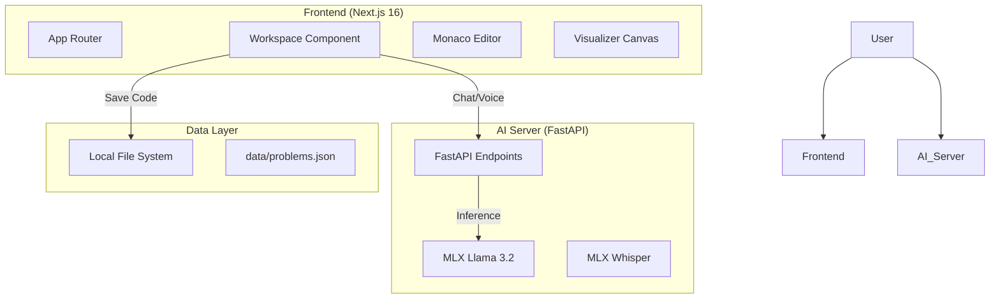

# LeetMastery (v2)

**LeetMastery** is a private, local-first algorithmic mastery platform designed to replicate the premium experience of LeetCode/NeetCode. It eliminates cloud dependencies, subscription gates, and distractions, offering a pure environment for coding practice.


## 🚀 Key Features

### 1. Distraction-Free Workspace
- **Split-Pane Interface**: A professional IDE layout with resizeable panes (Problem vs. Code).
- **Monaco Editor**: Full-featured code editor with syntax highlighting, auto-completion, and Minimap.
- **LeetCode Dark Theme**: accurately recreated "Dark Mode" aesthetic using a custom design system (`globals.css`) for reduced eye strain and high focus.

### 2. Local AI Pair Programmer ("Ask AI")
- **Privacy First**: No code is sent to OpenAI or Claude. Everything runs on your own hardware.
- **Context Aware**: The AI knows exactly which problem you are solving and the code you have currently written.
- **Voice Coding**: Just hold the microphone button and speak. The integrated **Whisper** model transcribes your voice to text, allowing for natural "Rubber Ducking".
- **Powered By**: 
    - **LLM**: `Llama-3.2-3B-Instruct` (via MLX) for intelligent hints and debugging.
    - **ASR**: `Whisper-Tiny` (via MLX) for near-instant speech recognition.

### 3. Interactive Data Structure Visualizers
- **Visualize the Invisible**: Don't just read about data structures—see them.
- **Supported Visualizers**:
    - **Array**: Watch array elements and indices.
    - **Linked List**: See nodes and pointers connecting them.
    - **Tree**: Automatic hierarchical layout for Binary Trees.
    - **Stack**: **[New]** Vertical visualization of Push/Pop operations.
    - **Graph**: **[New]** Circular layout rendering from Edge Lists.

### 4. Data Persistence
- **Local JSON**: All progress ("Solved", "Attempted"), code solutions, and metadata are saved to `data/problems.json`. 
- **No Database Setup**: Zero configuration required. Just run the app and start solving.

---

## 🏗️ Architecture

The application uses a **Split-Architecture** to leverage the best tools for Frontend and AI.



### Tech Stack
*   **Frontend**: Next.js 16.1 (App Router), React 19, Tailwind CSS v3 (Configured via PostCSS), Lucide Icons.
*   **Backend**: Python 3.10+, FastAPI, Uvicorn.
*   **AI/ML**: Apple MLX (Optimized for M1/M2/M3 Silicon).
*   **State Management**: React Hooks + Local Storage.

---

## 🛠️ Installation & Setup

### Prerequisites
*   **Node.js** (v18+)
*   **Python** (3.10+)
*   **Mac with Apple Silicon** (Required for MLX acceleration)

### 1. Clone the Repository
```bash
git clone https://github.com/dhanujdev/-LeetMastery-Localhost-App-
cd leet-mastery
```

### 2. Install Frontend Dependencies
```bash
npm install
```

### 3. Set Up AI Server
It is recommended to use a virtual environment.
```bash
python3 -m venv venv
source venv/bin/activate
pip install -r requirements.txt  # FastAPI, Uvicorn, mlx-lm, mlx-whisper
```
*(Note: If `requirements.txt` is missing, install manually: `pip install fastapi uvicorn mlx-lm mlx-whisper python-multipart`)*

---

## 🏃‍♂️ Usage

### 1. Start the AI Server (Backend)
Open a terminal:
```bash
# In leet-mastery/
source venv/bin/activate
python3 src/py/ai_server.py
```
*Server will start on `http://localhost:8080`*

### 2. Start the Application (Frontend)
Open a second terminal:
```bash
npm run dev
```
*App will start on `http://localhost:3000`*

### 3. Sanity Tests (Verify Installation)
1.  **Homepage**: Open `localhost:3000`. You should see the Problem Dashboard in Dark Mode.
2.  **Solve Page**: Click "Two Sum". Verify the Editor loads.
3.  **AI Chat**: Click the ✨ icon. Type "Hello". You should get a response from Llama-3.2.
4.  **Visualizer**: Click the **Visualize** tab. Select **Stack** or **Graph** to ensure SVG rendering works.

---

## 🔮 Future Roadmap

- [ ] **Docker Support**: Containerize both Frontend and Python Backend for one-command startup (`docker-compose up`).
- [ ] **Code Execution Sandbox**: Replace client-side mocks with a secure, Docker-based code runner (Piston or similar) to actually execute user Python/JS code against test cases.
- [ ] **SQL Database**: Migrate `problems.json` to SQLite or PostgreSQL for robust analytics and history tracking.
- [ ] **Advanced Visualizers**: Add support for **Heaps**, **Trie**, and **Dynamic Programming** Grids.
- [ ] **Copilot Integration**: Create a real-time code completion provider using the local model.

---

## 🤝 Contributing

This project is intended as a personal mastery tool, but contributions are welcome!
1.  Fork the repo.
2.  Create a feature branch (`git checkout -b feature/AmazingVisualizer`).
3.  Commit changes.
4.  Push to branch and open a PR.

---

**License**: MIT
