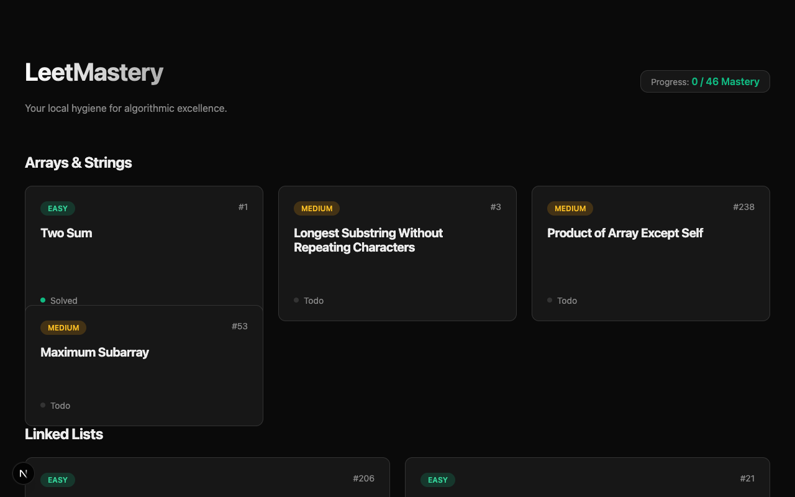
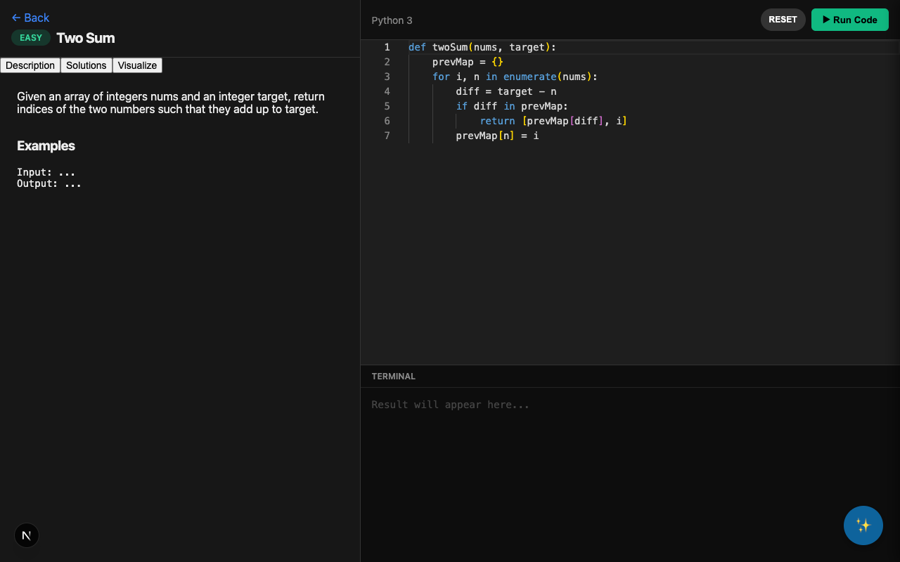

# LeetMastery

LeetMastery is a local algorithmic practice environment designed to help developers master coding challenges without distractions. It provides a clean, offline-capable interface for tracking progress and solving problems.

## Architecture

- **Framework**: [Next.js 15](https://nextjs.org/) (App Router)
- **Language**: JavaScript / React 19
- **Styling**: CSS Modules, Global CSS, and a custom design system focusing on minimalism.
- **Data Management**: Local file-based data system (via `src/lib/data` and `data/` directory).
- **Editor**: Monaco Editor integration (@monaco-editor/react) for a premium coding experience.

## Use Case

- **Technical Interview Preparation**: A focused environment to practice and track progress on curated algorithmic problems.
- **Skill Maintenance**: Keep your data structure and algorithm skills sharp with regular practice.
- **Offline Study**: Ideal for situations with limited internet access, allowing for uninterrupted study sessions.

## Problem Solved

- **Distraction-Free**: Unlike major online platforms, LeetMastery removes ads, social features, and gamification elements that can break focus.
- **Local & Private**: All progress and code solutions are stored locally on your machine. You own your data.
- **Customizable**: Since it's a local Next.js app, you can easily extend functionality, add new problem sets, or tweak the UI to your exact preferences.

## Screenshots

### Home Dashboard
The dashboard provides a clear overview of problem categories and your mastery progress.


### Problem Solver
The solving interface features a distraction-free description view and a powerful code editor.


## Getting Started

First, install dependencies:

```bash
npm install
```

Then, run the development server:

```bash
npm run dev
```

Open [http://localhost:3000](http://localhost:3000) with your browser to see the result.
